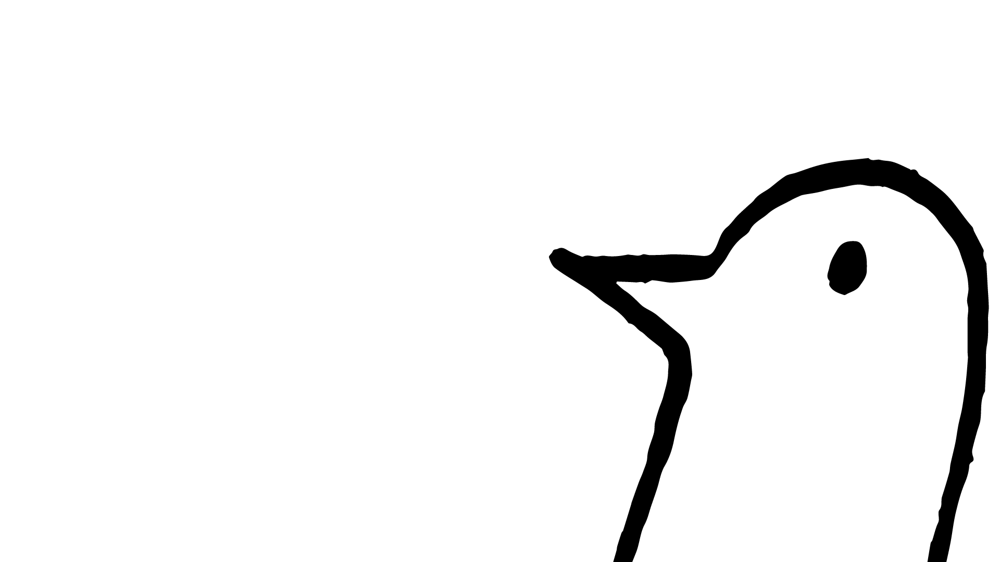
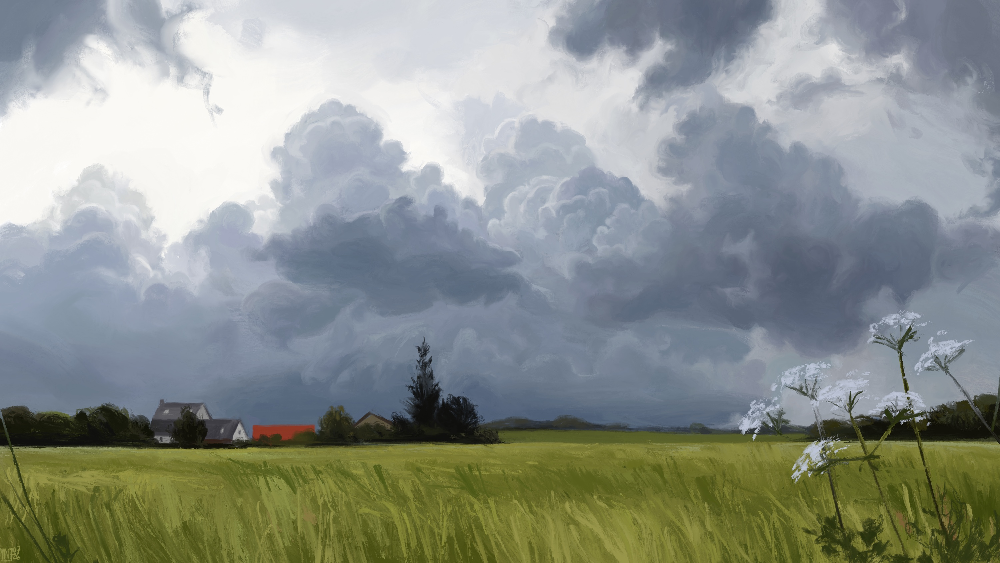
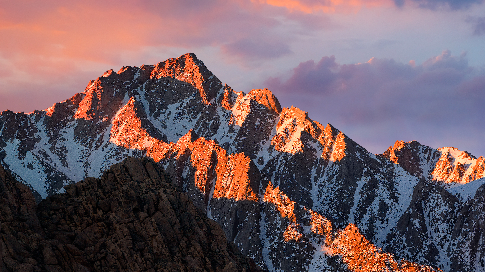
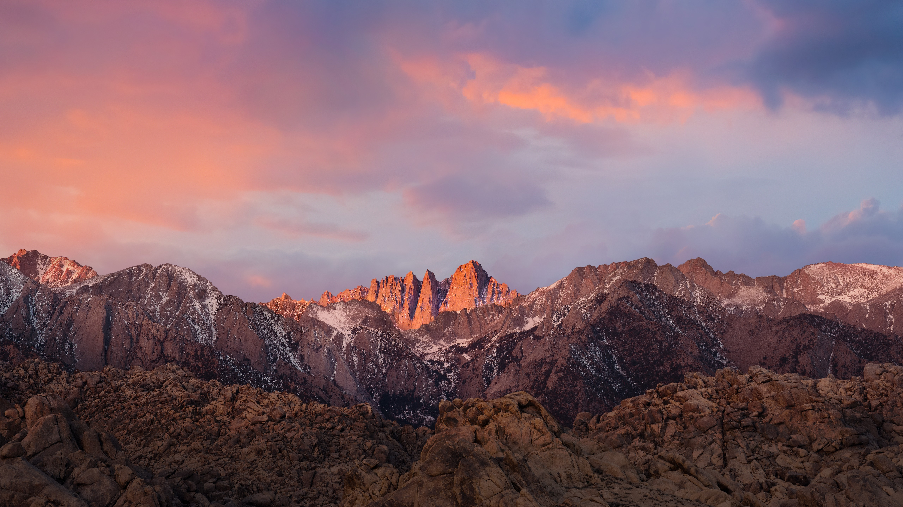
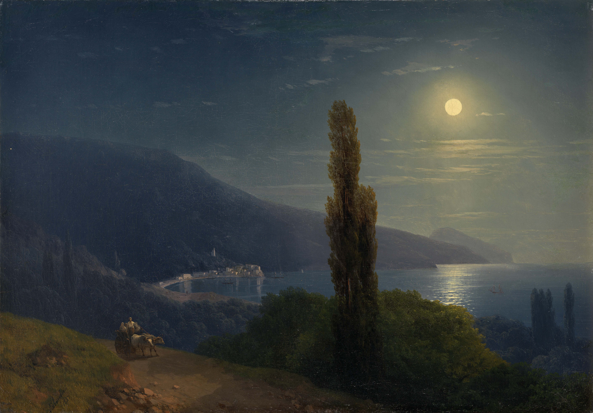
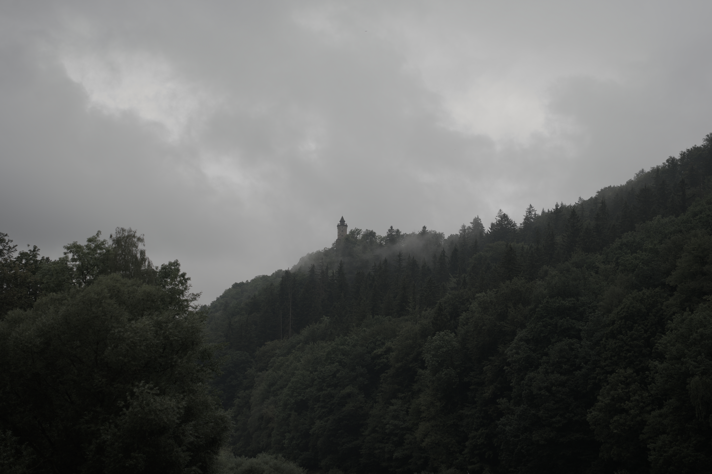

# wallpapers

| | |
|:-:|:-:|
|  |  |
|  |  |
|  |  |
|  |  |
|  |  |
|  |  |
|  |  |
|  |  |
|  |  |

```
curl -s https://raw.githubusercontent.com/cqley/wallpapers/refs/heads/main/install.sh | bash
```
